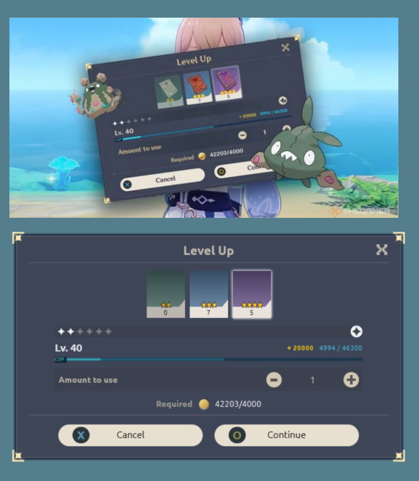

  <h1 align="center">
    CSS Challenge - Genshin Impact Card
     
  </h1>      

  

I don't play the game, but I happened across this card when browsing the web and decided to try and recreate it in css. 
     
  

  

   <strong>CSS</strong>&nbsp;  &nbsp; &nbsp; 
  

 

